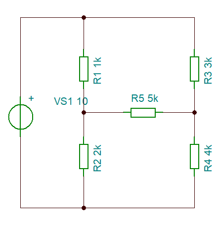
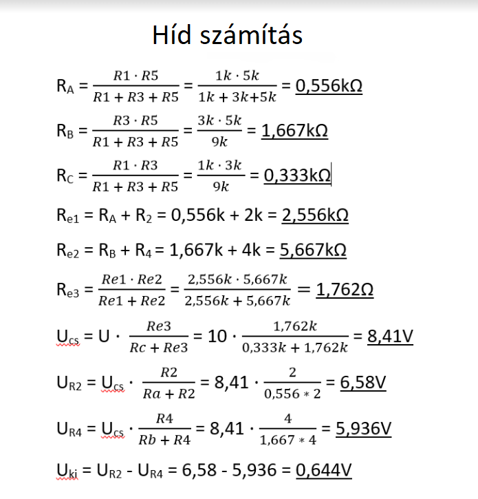
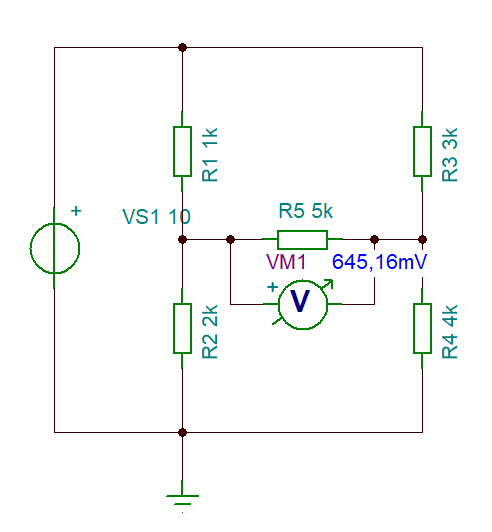

[Vissza](https://tomolyamilan.github.io/portfolio/)

# Hídkapcsolás

#### A project ismertetése:
#### Kiegyenlítetlen hídkapcsolás kimeneti feszültségének meghatározása
#### a) szimulációs méréssel(Tina)
#### b) valós méréssel(laborban)
#### c) számítással(delta/csillag átalakítással)
### Kapcsolási rajz

|Név|Jelölés|Érték|darab|
|----|----|----|----|
|Ellenállás|R1|1k|1|
|Ellenállás|R2|2k|1|
|Ellenállás|R3|3k|1|
|Ellenállás|R4|4k|1|
|Ellenállás|R5|5k|1|
|Áramforrás|U|10V|1|

### Az áramkör számítása

### Szimulációs mérés eredménye

## Önreflexíó
### A projekt egészen jó segítséget nyújtott a tananyag megértésében.
### Minen könnyen ment és nem volt probléma.